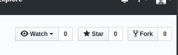
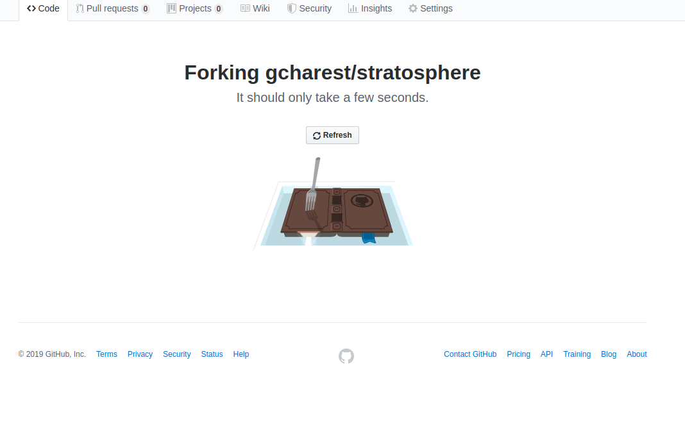

# Stratosphere 

Small project to go over the Git workflow with Stratosphere participants

## Task

Add you your (or a random) name to the list in the following document:

[names_noms.md](./names_noms.md)

## Requirements

You will need a GitHub account for this part.

>Keep your `username` and `password` handy!

## Steps
<!--markdownlint-disable MD029 MD032-->
1. Navigate to [GitHub](https://github.com)
2. Login
3. Go to the following project:
>[https://github.com/gcharest/stratosphere](https://github.com/gcharest/stratosphere)
4. Fork the repository:
>
5. Wait until it is done Forking
>
6. Confirm that your are in your own copy of the repository. The url at the top should be your own username instead of `gcharest`:
>`https://github.com/<your_username>/stratosphere`
7. Navigate to the `names_noms.md` file
8. Click on the `Edit` button
9. Add your (or a) name to the list:
>`* <your_name>`
10. Navigate to the bottom of the page.
11. Add a short comment explaining your change and clic on `Commit`
12. Navigate back to the root of the repository by clicking on `Code`
13. Notice the message explaining the difference between your copy and the original project
14. Create a pull request and enter a short message explaining your changes.
15. Go back to the original project and look for your pull request
<!--markdownlint-enable MD029 MD032-->
