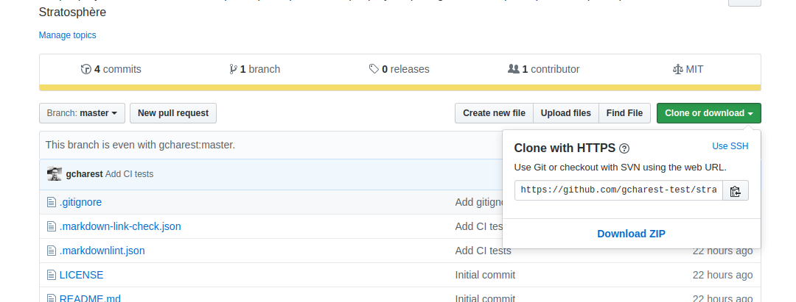

([Le français suit](#T%C3%A2che))

# Stratosphere 

Small project to go over the Git workflow with Stratosphere participants

## Task

Add you your (or a random) name to the list in the following document:

[names_noms.md](./names_noms.md)

## Requirements

You will need a GitHub account for this part.

>Keep your `username` and `password` handy!

## Steps
<!--markdownlint-disable MD029 MD032-->
1. Navigate to [GitHub](https://github.com)
2. Login
3. Go to the following project:
>[https://github.com/gcharest/stratosphere](https://github.com/gcharest/stratosphere)
4. Fork the repository:

5. Wait until it is done Forking

6. Confirm that your are in your own copy of the repository. The url at the top should be your own username instead of `gcharest`:
>`https://github.com/<your_username>/stratosphere`
7. Navigate to the `names_noms.md` file
8. Click on the `Edit` button
8. Add your (or a) name to the list:
>`* <your_name>`
10. Clone the repository locally:

>`git clone <repository_url> <folder_name> && cd <name>`
8. Add your (or a) name to the list:
>`* <your_name>`
9. Go to the bottom of the page and add a short "commit message"
10. Save (commit) the changes made to the file
11. Create a pull request and enter a short message explaining your changes.
12. Go back to the original project and look for your pull request

---

12. Check the status of your changes
>`git status`
11. Add your changes:
>`git add .`
12. Commit your changes:
>`giStratospheret commit -m "<short commit message>"`
13. Push your changes to your repository:
>`git push`
14. Navigate to your GitHub repository:
<!--markdownlint-enable MD029 MD032-->

---

# Stratosphère

Petit projet à partager avec les participantes et les participants de Stratosphère pour passer en revue le flux de travail Git.

## Tâche
